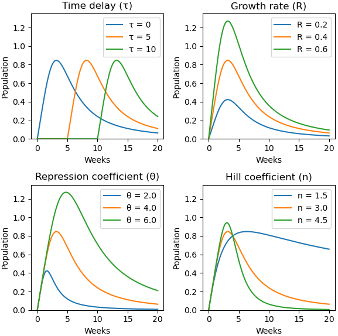
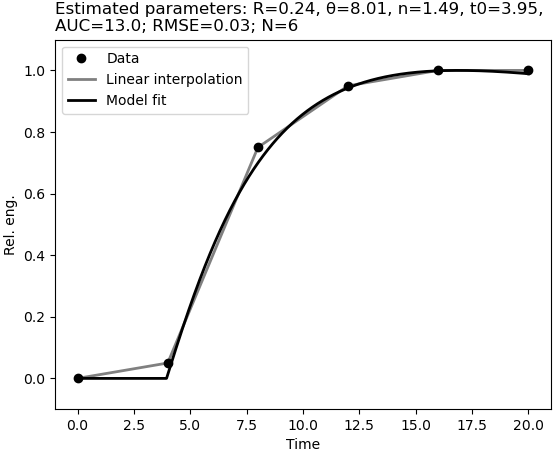
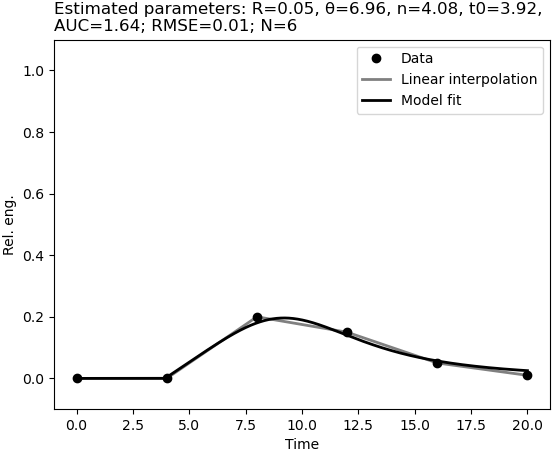
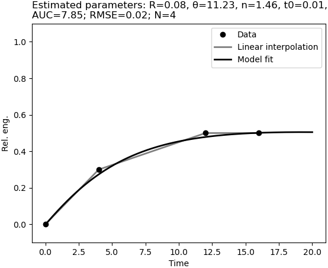

# ModelFitter
A package for simple parameter fitting.

## Installation

Open [Julia](https://julialang.org/) REPL in the project directory and run the following commands to instantiate the package environment with all necessary dependencies.
```
import Pkg
Pkg.activate(".")
Pkg.instantiate()
```

## Usage

See the [example script](scripts/data_fitting.jl) that demonstrates fitting of the single-humped function to the data.

## Input data

The input data are considered to be in the long form as shown in the [example data](data/example_data.csv). In this particular example, `Month` indicates the time vector and `rel.eng` data vector. The remaining columns are labels describing the individual members of the population. The data can be converted to the wide format by calling `load_long_data`.

## Single-Humped Function

The single-humped function has form
```
    x(t) = 0, if t < τ,
    x(t) = R * (t - τ) / (1 + ((t - τ) / θ) ^ n), if t >= τ,
```
where `τ` is time delay, `R` growth rate, `θ` repression coefficient, and `n` Hill coefficient. The figure below shows the effects of the individual parameters on the final function.



## Fit Examples

The following three figures show examples of the fitted single-humped function to various data. The titles of the individual figures indicate the estimated parameters of the single-humped function and additional parameters estimated by the model: area under the curve (AUC), root-mean-square error (RMSE) to quantify the quality of the fit, and the number of available data points (N).






